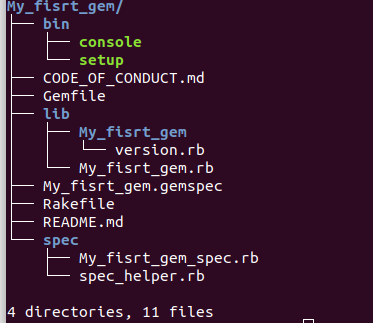
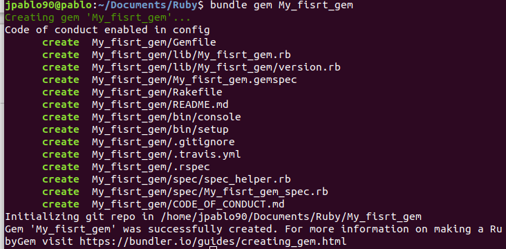

# Ruby Writting a Ruby Gem

In this file will be given the steps to create a Gem in Ruby. There are many ways to create a Gem in Ruby, this document will  only focus on one.

## What is a gem?

Gem is a ruby software package which offers particular functionalities to the ruby programs. Each gem have a name, version, plataform, and follows the same standard structure of code organization. In the Figure 1  the common struct of a gem is presented.

*Figure 1.Common structure of a gem in ruby.*

Gem is a ruby software package which offers particular functionalities to the ruby programs. Each gem have a name, version, plataform, and follows the same standard structure of code organization. In the Figure 1  the common struct of a gem is presented.

## Create a ruby gem with bundler and rspec

Bundler is a tool for managing Rubygems dependencies in Ruby libraries. To create a new Ruby gem using the bundler tool, the steps are listed below:

1. The first is to see if you have installed bundler on your system, in the terminal type bundle -v, this command display you the version of bundler that you have, otherwise you have to install this in your system.
2. To install Bundler in your system you need to type gem install bundler.
3. Once you have installed bundler, all you have to do is type bundle gem followed of the name of your gem.

**Example of how to create a gem in ruby:**

The name of the gem will be My_first_gem, so in the terminal type the instruction of step three.

*Figure 2.Creating a gem in ruby with bundler.*

When you use bundler for first time, you will be asked to make a initial configuration, in the which you decide if the unit test are added, among other components. The tree of your gem should look like the struct in the Figure 1.